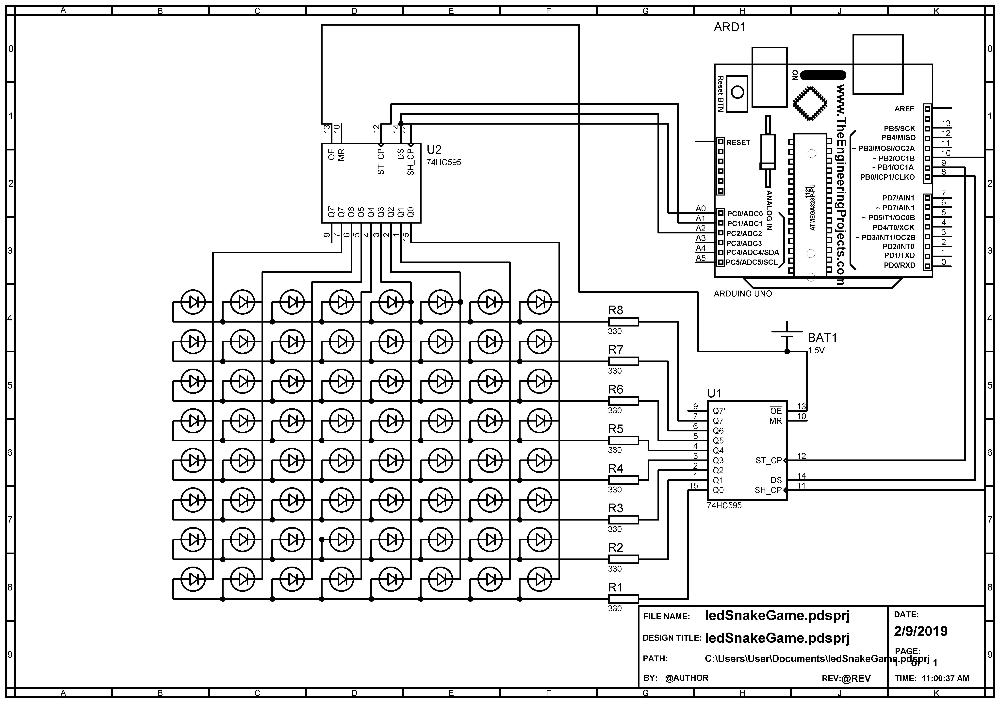

# LED-Matrix-Snake-Game
## Introduction
It is arduino based project inspired by [Classic Snake game](https://en.wikipedia.org/wiki/Snake_(video_game_genre)).
A player can play the game using a simple controller  made up of four push buttons . Snake is displayed on an 8 by 8 LED matrix board and the additional information like the current score and highscore is displayed on the LCD Display.
## Pre-requisites
* Arduino Programming.
* Basic AVR programming (Used in this project for creating a timer function to manipulate the speed of Snake).
* Prior experince with matrix board and soldering techniques would be handy.
* Basic understanding of shift registers.
## Methodology
In order to create this project, First of all it's circuit design was simulated using proteus and part of the circuit was tested on Breadboard. After successful testing, Full circuit was made on a matrix board. Then the game's logic was determined and tested on the matrix board circuit. Finally, the whole circuit was printed on a PCB board. The LED Matrix was covered with a 
## Circuit Diagram
Note: This diagram does'nt include circuit for the LCD Screen.

## Final Product

A simple controller, made using a matrix board, consisted of four push buttons. For the display, 
